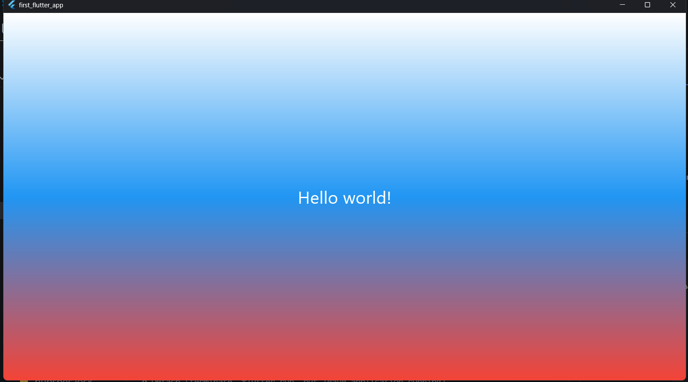

# Лабораторная работа №3. Знакомство с Flutter
*Ознакомление с основным инструментом кроссплатформенной разработки — Flutter. Создание и запуск первого Flutter-проект*
## Информация об авторе
**Имя:** Артём  
**Группа** ИСП-241
## Стек и версии
* Flutter 3.47.4
* Dart 3.13.3
* Платформа: Windows
* IDE: VS Code
## Скриншот приложения

## Как запустить
1. Клонировать репозиторий
2. Перейти в папку проекта
3. Выполнить `flutter pub get`
4. Запустить командой `flutter run -d chrome`
## Что изучили
* Что такое Flutter
* Как написать приложение с нуля
* Как запустить приложение
